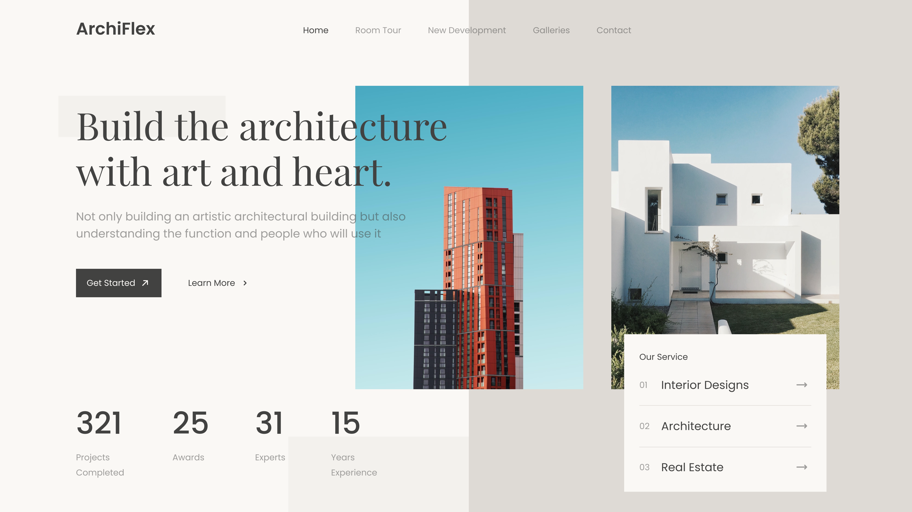

<h1 align="center" style="color: #0366d6;">
   HTML-CSS-Header_Architecture
</h1>

Welcome to the "Header - Architecture" Project! 🏡🎨
This project has been carefully designed to provide you with a unique architectural header that combines style, elegance, and functionality. With a modern and optimized structure, it is intended to offer the best visual experience on screens with a width of 1200px. Get ready to add an impressive and professional touch to your web projects!

## Repository Content

This repository contains all the necessary files to implement the impressive architectural header. Below is a description of the essential files and folders:

1. 📂 **img/**: Folder that holds all the images required for the project. Make sure to add your images here for them to be used correctly in the design.
2. 📄 **index.html:** The main HTML file that structures the page, forming the foundation of the architectural header.  
3. 📂 **css/**:  Folder containing the visual style files.
   📄 **style.css**:  The main CSS file that defines the visual style of the project.
 

<h2 align="center">
  Header: Architecture 
</h2>

 

## Project Structure

The project's code is carefully organized to ensure easy understanding and maintainability. The structure is as follows:

- 🧱 HTML (index.html): This file defines the structure and content of the page, from the initial header to the services section, including the fundamental elements that make up the interface. It serves as the starting point for building the webpage.
- 🎨 CSS (style.css): This file is responsible for establishing the visual style of the project. It defines everything from typography, colors, and margins to the layout and arrangement of sections. It manages the aesthetics and visual interactivity of the header

## Resources Used

🌐 Google Fonts: The fonts Poppins and Playfair Display are used to give the project a modern and elegant touch.

- Poppins: Chosen for its clean and geometric style, ideal for headings and highlighted text.
- Playfair Display: Selected for its classic elegance, perfect for subtitles and visual details.

## Contributions 🤝

Your participation is valuable! If you have ideas, improvements, or find any issues, feel free to:

- Open issues to report bugs or suggest improvements.
- Create pull requests to propose changes directly.
- Share your feedback and experiences to help refine these examples.

Every contribution counts towards building together. 🌟

## Professional Services 💼

I am available to work on web design projects, whether for individuals or businesses. Do you have a project in mind, or need assistance with your website?

Let’s talk and bring your digital vision to life! 🚀
 

## Licencia 📜

This project is licensed under the  [MIT] - Check the [LICENSE](LICENSE) file for more details.

---

<h1 align="center" style="color: #0366d6;">
   HTML-CSS-Header_Architecture
</h1>

Bienvenido al Proyecto "Header - Architecture"! 🏡🎨
Este proyecto ha sido cuidadosamente diseñado para ofrecerte un encabezado arquitectónico único, que combina estilo, elegancia y funcionalidad. Con una estructura moderna y optimizada, está pensado para ofrecer la mejor experiencia visual en pantallas con un ancho de 1200px. ¡Prepárate para darle un toque impresionante y profesional a tus proyectos web!

## Contenido del Repositorio

Este repositorio contiene todos los archivos necesarios para implementar el impresionante encabezado arquitectónico. A continuación, te ofrecemos una descripción de los archivos y carpetas esenciales:

1. 📂 **img/**: Carpeta que alberga todas las imágenes necesarias para el proyecto. Asegúrate de agregar tus imágenes aquí para que se utilicen correctamente en el diseño.
2. 📄 **index.html:** El archivo HTML principal que estructura la página, formando la base del encabezado arquitectónico  
3. 📂 **css/**: Carpeta que contiene los archivos de estilo visual.
   📄 **style.css**: El archivo CSS principal que define el estilo visual del proyecto.
 

<h2 align="center">
  Header: Architecture 
</h2>

 

## Estructura del Proyecto

El código del proyecto está cuidadosamente organizado para garantizar una fácil comprensión y mantenimiento. La estructura es la siguiente

- 🧱 HTML (index.html): Este archivo define la estructura y el contenido de la página, desde el encabezado inicial hasta la sección de servicios, pasando por los elementos fundamentales que conforman la interfaz. Es el punto de partida para la construcción de la página web.

- 🎨 CSS (style.css):  Este archivo es responsable de establecer el estilo visual del proyecto. Define todo, desde la tipografía, colores y márgenes hasta el diseño y la disposición de las secciones. Aquí se maneja la estética y la interactividad visual del encabezado.

## Recursos Utilizados

🌐  Google Fonts: Se emplean las fuentes Poppins y Playfair Display para aportar un toque moderno y elegante al proyecto.
- Poppins: Elegida por su estilo limpio y geométrico, ideal para títulos y texto destacado.
- Playfair Display: Seleccionada por su elegancia clásica, perfecta para los subtítulos y detalles visuales.

## Contribuciones 🤝

¡Tu participación es valiosa! Si tienes ideas, mejoras o encuentras algún problema, siéntete libre de:

Abrir issues para reportar errores o sugerir mejoras.
Realizar pull requests para proponer cambios directamente.
Compartir tus comentarios y experiencias para ayudar a perfeccionar estos ejemplos.
Cada aportación cuenta para seguir construyendo juntos. 🌟

## Servicios Profesionales 💼

Estoy disponible para trabajar en proyectos de diseño web, ya sea para particulares o empresas. ¿Tienes un proyecto en mente o necesitas asistencia con tu sitio web?

¡Hablemos y hagamos realidad tu visión digital! 🚀
 

## Licencia 📜

Este proyecto está bajo la licencia [MIT] - Consulta el archivo [LICENSE](LICENSE) para más detalles.
